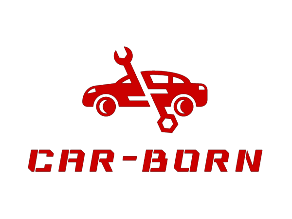
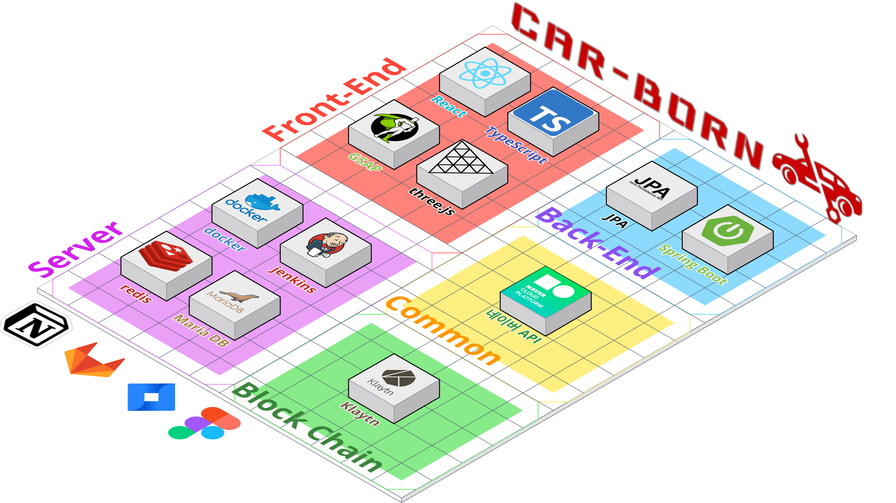

# CAR-BORN

 

## 프로젝트 소개
**CAR-BORN**은 블록체인 프로젝트로, 가상의 중고차 거래 플랫폼을 위한 시스템 설계 및 구현을 하였으며, 어떤 기능이 필요할지 요구사항을 추려내고, 해당 요구사항에 따라 기능을 구현한 **개발진의 역량향상** 프로젝트입니다.

크게 웹 Front-end, Back-end, Blockchain 파트로 나누어, 7주동안 프로젝트를 진행했습니다.

 

## 목차
- [참여자](#참여자)
- [느낀점](#느낀점)
- [발표자료](#발표자료)
- [UCC](#UCC)
- [기간](#기간)
- [기능구현](#기능구현)
- [사용기술스택](#사용기술스택)
- [스크린샷](#스크린샷)

 

## 참여자

### Back-end

| 한재용([@rigizer](https://github.com/rigizer)) | 정명관([@rhalsemd](https://github.com/rhalsemd)) | 김지현([@potatohyun](https://github.com/potatohyun)) |
|:----:|:----:|:----:|
||||

 

### Front-end

| 이주형([@22JH](https://github.com/22JH)) | 한승준([@hanseungjune](https://github.com/hanseungjune)) | 김태헌([@gangnamssal](https://github.com/gangnamssal)) |
|:----:|:----:|:----:|
||||

 

## 느낀점

### 한재용
- @ControllerAdvice를 통해 GlobalExceptionHandler를 만들어 예외처리를 해줌으로써, 클라이언트와 통신시 오류에 대응하여 안정성을 높인 것이 이번 프로젝트에 있어 가장 큰 성과라고 생각됩니다. 
- JPA에 대한 메소드 이해가 완벽히 되지 않았고, Optional을 제대로 활용하지 못했습니다. 또한, Entity 설계 수준이 부족하여 중복된 코드가 있었던 점 등을 차후에 더 보완할 것을 다짐하는 계기가 되었습니다.
- 기대한 만큼 완벽한 프로젝트는 아니었지만, 추후에 있을 프로젝트를 더 완성도 있게 만들 수 있게 한 그런 프로젝트가 아니였나 싶습니다. CI/CD의 기술수준을 높이고, API 자체의 설계를 조금 더 Restful 하게 만들어 더 향상된 코드 품질을 보여주었습니다.

### 정명관
- Back-End로서 잘한 부분은 구체적으로 이번 프로젝트에서 Mapping Interface나 Lazy가 아닌 Eager를 쓰는 등 많은 시도를 하게 되어서 JPA를 사용하는 것이 많이 익숙해졌으며, Multipart File도 처음 사용하다보니 DTO를 통해 데이터를 받을 때 @ModelAttribute를 사용해서 받는 방식을 시도하거나, 패키지 구조를 세부적으로 나누어서 효율적인 파일 구조 처리 등 전체적으로 Back-end 실력이 향상되었습니다.
- 프로젝트 진행이 원래 계획했던대로 완벽하게 진행되지 않아서 프로젝트 전반적으로 미흡한 부분이나 디테일적인 부분이 떨어져서 아쉬웠습니다. 그래서 이번 프로젝트를 계기로 다음 프로젝트에서는 기획 및 설계를 꼼꼼히 하고, 사전 진행 계획을 잘 세워서 더 좋은 프로젝트를 만들 계획입니다.
- 태초에 설계한대로 완벽하게 완성되지는 않았지만 실패가 아닌 배운점이 많다는 것이 마음에 들었습니다. 또한 이번 프로젝트를 토대로 위에서 언급한 것 외에도 많은 지식 및 실력을 얻어 미래 개발자가 되는 초석을 마련하는데 도움이 되었다고 생각합니다.

### 한승준
- 이번 프로젝트에서는 백엔드와의 양방향 통신을 통해 회원 관리 및 상태 관리를 성공적으로 처리하면서, 컴포넌트의 재사용성을 높였다는 점에서 잘한 부분이 있다고 생각합니다.
- 프로젝트 진행 도중 기획 부족으로 인해 디자인 측면에서 통일성이 부족하고, 상태 관리에서도 팀원들과의 소통이 부족하여 예상치 못한 문제가 발생했습니다. 또한, 재사용성을 높이기 위한 구체적인 컴포넌트 구조를 성립하지 못했고, 백엔드에서 보내주는 데이터를 명확히 확인하지 못해 프론트에서 문제가 발생한 점에 대해 교훈을 얻었습니다.
- 이번 프로젝트를 통해 백엔드와의 소통과 기획의 중요성을 깨달았습니다. 모든 구성원들이 함께 진행해야 하는 DB 구조나 협업툴 사용 등의 작업도 중요하며, 개발의 덕목은 협업과 소통에 있다는 것을 다시 한번 느꼈습니다.

### 이주형
- React-Query를 사용해 데이터 캐싱을 함으로써 서버와의 불필요한 api 통신을 줄여 성능 개선을 이뤄냈습니다. 그리고 three-js 라이브러리를 사용해 webGL을 간접적으로 사용하는 법을 배우고 효과적으로 3D 모델링을 구현해 사용자에게 시각적으로 화려함을 줬습니다.
- 이번 프로젝트에서는 기획을 세우는 시간이 적어 기대했던 만큼 프로젝트의 완성도가 나오지 않았던 것이 아쉬웠습니다. 코드 컨벤션과 라이브러리도 통일 되지 않아 가독성이 떨어져 디버깅에도 많은 시간을 허비했던점도 아쉬웠습니다. 다음 프로젝트에선 팀원들의 역량 파악을 확실하게 해서 기획과 계획을 세우고 조금더 엄격한 규칙을 만들어 서로간의 코드 리뷰와 디버깅을 할 때 조금 더 호율적으로 할 수 있도록 노력해야겠습니다.
- 이번 프로젝트는 프로젝트를 원할하게 진행시키기 위한 조건에 대해 배울 수 있었던 시간이였습니다. 이번 경험을 통해 다음 프로젝트에서는 더 많은 케이스들을 고려 할 수 있게 됐습니다.

### 김태헌
- React-Query를 사용하여 서버 데이터와 클라이언트 데이터를 분리하여 관리하고, 에러 바운더리(ErrorBoundary)를 활용하여 서버 데이터에서 오류가 발생하더라도 개별 컴포넌트에서 따로 처리하여 전체 컴포넌트의 안정성을 향상시켰다고 생각합니다.
- 이번 프로젝트를 진행하면서 백엔드와의 소통의 중요성을 다시 한 번 느꼈습니다. 프론트엔드에서 먼저 API 요청 코드를 작성하여 컴포넌트를 구현했지만, 백엔드 데이터가 변경되면서 코드를 많이 수정해야 했습니다. 다음 프로젝트에서는 미리 디자인 요소를 작업한 뒤 로직을 작성하여 백엔드와의 조화를 더욱 잘 맞춰야겠다고 생각합니다.
- 프로젝트 주제 선정과 블록체인 기술 공부에 많은 시간을 소요하여 실질적으로 코딩에 투입할 시간이 부족한 상황에서, 팀원들과 계속해서 의사소통을 하며 우리가 할 수 있는 부분과 할 수 없는 부분을 빠르게 정리하여 기간 내에 완성할 수 있었습니다. 이번 프로젝트를 진행하면서 시간 관리와 의사소통의 중요성을 다시 한 번 깨닫게 되었습니다.

### 김지현
- Spring과 JPA등 기술적인 모든 부분이 서툴렀지만, DTO나 interface를 왜써야하는지, 언제 써야하는지, 또한 ServiceImplement등을 언제 사용해야 하는 것인지 등 최대한 이해해서 쓰려고 했습니다. 초반에는 속도가 더뎠지만, 꼼꼼히 이해하며 공부하고 진행했던 덕분에 후반부에는 속도를 붙일 수 있었습니다.
또한 컨벤션을 정해 최대한 지키려고 노력했으며, 특히 RestAPI 설계원칙을 중요시해 결과적으로 좀 더 깔끔한 코드를 작성 할 수 있었습니다.
- 다수의 의견을 최대한 반영하려다 보니, 프로젝트에서 구현해야 할 것은 많아졌습니다. 결과적으로 기능 구현은 다 했지만, 그 외의 것들에는 좀 더 신경을 쓰지 못하게 되었습니다. 때문에 계획의 중요성을 깨닫았고 의견이 많을때, 모든 의견을 수용하는 것도 좋지만 판단하에 어디에 중점을 둘 것인가를 정하는 것 역시 중요하다는 것을 배웠습니다.
- Spring이 처음이라 배움의 의지가 좀 더 컸습니다. 다소 실력차이가 있었던 터라 업무 분담에 있어서 소극적인 자세를 보였습니다. 어떤 기술이든 배움의 의지를 가지는 것도 좋지만 기여도에 조금 더 욕심내도 더 많은 것을 배울 수 있을 것 같습니다.

 

## 발표자료
[다운로드](data/구미_2반_D209_발표자료.pptx) (*.pptx)

 

## UCC

 

## 기간
2023.02.20. ~ 2023.04.07.

 

## 기능구현

- Back-end
    - 고객, 정비소, 검수원, 보험사에 따른 사용자 구분
    - 이용자별 로그인시 로그 기록 및 조회
    - 회원가입시 네이버 클라우드 플랫폼의 SMS 인증 API를 통해 본인인증
    - 사업자등록증 및 차량등록증 문서 OCR 인식
    - JPA 및 Pageable 이용한 페이징 구현
    - Swagger/OpenAPI를 이용하여 API 명세서 구현
- Front-end
    - React.js 프레임워크 활용 및 Typescript 반영
    - React-Query를 이용한 데이터 캐싱
    - WebGL 및 Three.js 사용한 3D 모델 렌더링
    - Back-end에서 제공한 JWT 토큰을 이용해서 로그인 구현
    - 오류 발생시 커스텀 Alert 제공
    - 네이버맵을 이용하여 정비소, 검수소, 보험사 위치 제공
- Blockchain
    - Kakao Klaytn을 활용한 자동차 히스토리 내역을 블록체인화 하여 기록 및 정보제공
- Infra
    - Jenkins(Java 17), Docker, Docker-Compose를 활용하여 Merge Request WebHook 발생시 빌드 및 배포
    - Jenkins Pipeline 활용 및 SSH 원격서버 제어, CURL 이용한 배포완료 메세지 전송
    - Spring Boot 및 React.js 동시빌드

 

## 사용 기술스택

 

## 스크린샷

- <h5>주기능 1</h5>

| 기능 1 | 기능 2 | 기능 3 |
|:----:|:----:|:----:|
||||

 

- <h5>주기능 2</h5>

| 기능 4 | 기능 5 |
|:----:|:----:|
|||

| 기능 6 | 기능 7 |
|:----:|:----:|
|||

 

 
